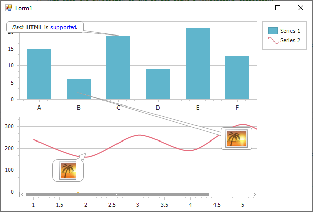

<!-- default badges list -->

<!-- default badges end -->

# Chart for WinForms - How to Accompany a Chart, its Pane, or Series Point by Text or Image Annotations

The following example demostrates how to create text and image annotations and anchor them to a chart, its pane, and a series point. 

## Files to Review 

* [Form1.cs](./CS/AnnotationsSample/Form1.cs) (VB: [Form1.vb](./VB/AnnotationsSample/Form1.vb))

## Documentation

[Annotations](https://docs.devexpress.com/WindowsForms/7858/controls-and-libraries/chart-control/annotations?v=22.2&p=netframework)

## More Examples 

- [How to Show a Tooltip with a Series Point's Data](https://github.com/DevExpress-Examples/how-to-show-a-tooltip-with-a-series-points-data-e126)
- [How to Show Series Labels for Hot-Tracked Points](https://github.com/DevExpress-Examples/how-to-show-series-labels-for-hot-tracked-points-e2483)

